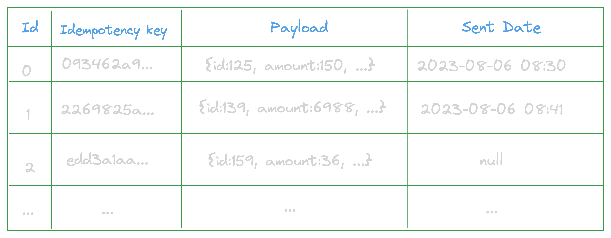

# Outbox Pattern

Documentação com exemplos na prática de como funciona o Outbox Pattern em microsserviço. 

## O que é o Outbox Pattern

### Qual problema ele resolve

Também conhecido como Transactional Outbox Pattern, é usado em situações onde você precisa garantir a transação de uma operação, salvar no banco e enviar os eventos. Imagina que uma transação chegou na sua conta digital, você já subtraiu o saldo da pessoa no banco de dados, mas acaba tendo problemas ao enviar a mensagem para o seu serviço de mensageria, informando que o esse valor deveria ser enviado para outra conta externa, por conta de instabilidade, ele estar fora do ar... . Como você lida com isso? Quais eventos já foram enviados, quais precisaremos reenviar?

É impossível fazer uma transação entre um banco de dados e um message broker, para resolver esse problema a gente poderia fazer de duas formas:

- Se der erro ao enviar a mensagem para o tópico, a gente desfaz o passo anterior, só que isso tem alguns impactos, muitas vezes o processo de desfazer é mais demorado, e precisaria ser feito de forma assíncrona(mas não temos mensageria para isso kkk), o outro é que por motivos 100% técnico tu podes perder de fazer milhares de vendas ou transações bancárias, isso não é legal.

- Outra forma de garantir isso é com o Outbox Pattern, que vamos entrar em detalhes a seguir, e vamos entender o porquê é uma solução melhor do que a anterior.

### Como ele funciona

A grande maioria dos bancos de dados conseguem dar garantia de uma transação, que basicamente é executar mais de uma ação no banco de dados como se fosse uma só, aí todos funcionam ou nehuma funciona, e já que não da para fazer esse fluxo de transação entre um banco e um message broker como expliquei anteriormente, o Outbox Pattern tem como ideia pricipal de em uma unica transação para o banco de dados você salvar a ação, e o evento relacionado a ação, e depois vem uma oturo serviço que roda em background que pega a mensagem de evento do banco e coloca no message broker, dessa forma você nunca vai perder um evento, e vais ter a garantia se ele já foi enviado ou não.

#### Estrutura de uma tabela de eventos

Existem duas abordagens, uma de criar uma tabela generica, com os dados que tem que ter no evento, muitas das vezes uma coluna JSON se tiverem usando um banco relacional, e outra é ter uma tabela específica para cada tipo de evento, mas todas elas tem alguns pontos em comum.

- Id
- Chave de Idempotencia
- Já foi processado
- Data do processamento
- Mensagem que deve ser enviada no evento

Em tabelas genricas você pode ter coisas como

- Qual topico/fila esse evento deve ser enviado
- Qual o tipo desse evento(transação, saque...)

Já foi processado e Data do processamento podem se tornar uma coisa só, essa é a coluna que garante que a mensagem já foi enviada ou não, e quando ela foi enviada.

#### Possíveis problemas

Mas um dos possíveis questionamentos é em relação a esse serviço que adiciona mensagem no tópico, ele pode dar problema novamente! Se você salvar no banco que foi enviado e deu problema para enviar teria que dar um rollback, sim, aí seria um problema parecido do inicial, mas, mais simples de resolver. Mas, na prática, o ideal é enviar a mensagem e depois salvar no banco de dados que foi feito com sucesso. Você pode até argumentar que o banco de dados pode estar fora do ar depois que a mensagem foi enviada, e ela seria enviada duas vezes, sim, esse é um problema, mas conseguimos resolver ele de uma forma simples, que é criar consumidores idempotentes, da uma olhada nesse vídeo que eu falo um pouco mais sobre o assunto.
[[Arquitetura] O que são chaves de idempotência?](https://youtu.be/U0DyJx68oCY)

### CDC - Change Data Capture

TODO:

## Inbox Pattern

TODO:

Obs.: O exemplo usado não é 100% real, foram retirados alguns conceitos para facilitar a explicação*