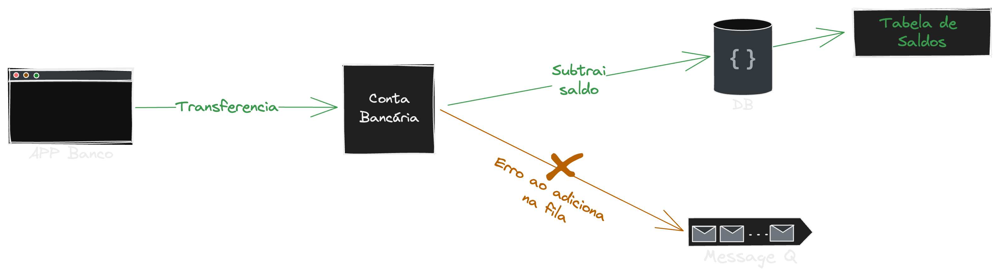

# Outbox Pattern

Documentação com exemplos na prática de como funciona o Outbox Pattern em microsserviço. 

## O que é o Outbox Pattern

### Qual problema ele resolve

Também conhecido como Transactional Outbox Pattern, é usado em situações onde você precisa garantir a transação de uma operação, salvar no banco e enviar os eventos. Imagina que uma transação chegou na sua conta digital, você já subtraiu o saldo da pessoa no banco de dados, mas acaba tendo problemas ao enviar a mensagem para o seu serviço de mensageria, informando que o esse valor deveria ser enviado para outra conta externa, por conta de instabilidade, ele estar fora do ar... . Como você lida com isso? Quais eventos já foram enviados, quais precisaremos reenviar?

É impossível fazer uma transação entre um banco de dados e um message broker, para resolver esse problema a gente poderia fazer de duas formas:

- Se der erro ao enviar a mensagem para o tópico, a gente desfaz o passo anterior, só que isso tem alguns impactos, muitas vezes o processo de desfazer é mais demorado, e precisaria ser feito de forma assíncrona(mas não temos mensageria para isso kkk), o outro é que por motivos 100% técnico tu podes perder de fazer milhares de vendas ou transações bancárias, isso não é legal.

- Outra forma de garantir isso é com o Outbox Pattern, que vamos entrar em detalhes a seguir, e vamos entender o porquê é uma solução melhor do que a anterior.

### Como ele funciona

A grande maioria dos bancos de dados conseguem dar garantia de uma transação, que basicamente é executar mais de uma ação no banco de dados como se fosse uma só, aí todos funcionam ou nehuma funciona, e já que não da para fazer esse fluxo de transação entre um banco e um message broker como expliquei anteriormente, o Outbox Pattern tem como ideia pricipal de em uma unica transação para o banco de dados você salvar a ação, e o evento relacionado a ação, e depois vem uma oturo serviço que roda em background que pega a mensagem de evento do banco e coloca no message broker, dessa forma você nunca vai perder um evento, e vais ter a garantia se ele já foi enviado ou não.

### CDC - Change Data Capture

### Outras vantagens

TODO:

## Inbox Pattern

TODO:

Obs.: O exemplo usado não é 100% real, foram retirados alguns conceitos para facilitar a explicação*